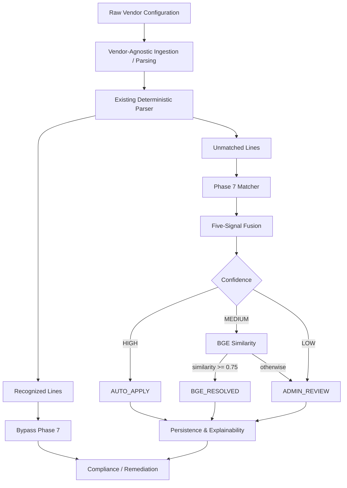
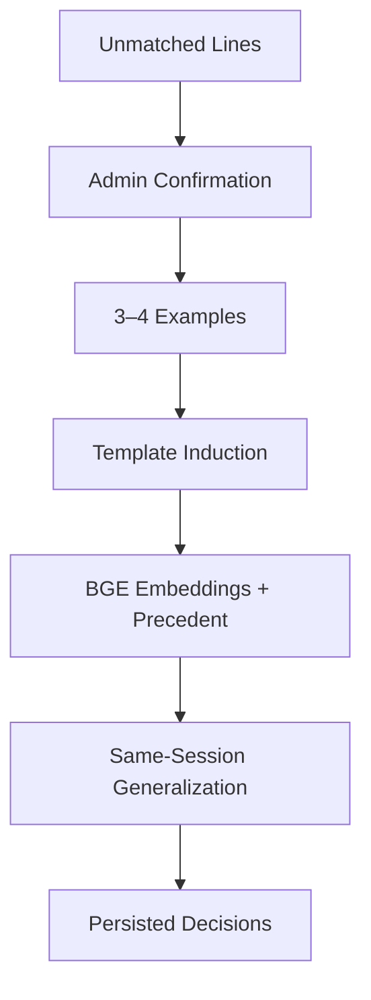
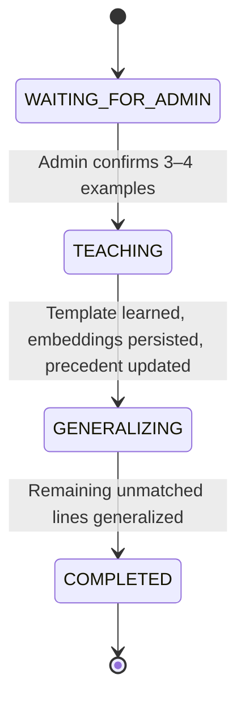

# AI-Augmented Vendor-Agnostic Network Compliance Auditor

**Smart India Hackathon 2026 · Project ID: SIH26155**


An AI-augmented network compliance auditor that analyzes device configuration files from multiple vendors and maps vendor-specific syntax to a **common canonical security-control representation**, so that compliance can be evaluated once, independent of vendor.

> **Implementation status:** Phases 1–7 are implemented and verified. **Phase 8 is planned and has NOT been implemented in the current repository.**

---

## Table of Contents

- [Overview](#overview)
- [Key Features](#key-features)
- [Architecture](#architecture)
- [Project Structure](#project-structure)
- [Phase-Wise Implementation](#phase-wise-implementation)
- [Phase 7 — Multi-Evidence Matching Engine & Interactive Teaching Loop](#phase-7--multi-evidence-matching-engine--interactive-teaching-loop)
- [Phase 7 Verification](#phase-7-verification)
- [Database Architecture](#database-architecture)
- [Technology Stack](#technology-stack)
- [Design Principles](#design-principles)
- [Current Status](#current-status)
- [Upcoming: Phase 8](#upcoming-phase-8)

---

## Overview

Network devices from different vendors express the same security intent in very different syntax. This project resolves that by translating each vendor's configuration into a shared canonical model and evaluating compliance against it.

| Item | Details |
|---|---|
| **Supported vendors** | Cisco IOS · Juniper JunOS · Fortinet FortiOS · Palo Alto PAN-OS |
| **Compliance frameworks** | CIS · STIG · ISO 27001 |
| **Canonical security controls** | 20 |

**Core idea:**

```
Vendor-specific configuration
        ↓
Deterministic parsing
        ↓
Canonical compliance representation
        ↓
Compliance evaluation
```

**Phase 7** adds an adaptive matching layer for configuration lines that the deterministic parser cannot recognize.

---

## Key Features

- Vendor-agnostic canonical compliance representation
- Multi-vendor configuration analysis
- Deterministic configuration parsing
- PostgreSQL-backed compliance knowledge
- Leakage-free device/configuration-level dataset splitting
- **Phase 7 multi-evidence matching** with five-signal evidence fusion
  - Context-aware matching
  - Value-semantic matching
  - Negation hard gate
  - Framework-fit scoring
  - Historical precedent
- BGE + pgvector similarity for MEDIUM-confidence cases
- Human-in-the-loop teaching
- Template induction from administrator-confirmed examples
- Same-session generalization
- Explainable and persistent matching decisions

---

## Architecture

Phase 7 **does not replace or duplicate** the deterministic parser. Only lines the parser leaves unmatched enter Phase 7.



### Phase 7 Teaching Path



---

## Project Structure

```
.
├── configs/            # Device configuration files
├── controls/           # Canonical security-control definitions
├── db/                 # Database schema and setup
├── dependencies/       # Configuration dependency rules
├── mappings/           # Vendor command → canonical control mappings
├── phase6/             # Leakage-free dataset, split manifest
├── phase7/             # Multi-evidence matching engine (see below)
├── remediation/        # Remediation rules
├── schemas/            # Data schemas
└── tests/              # Automated tests
```

### Phase 7 Modules

```
phase7/
├── api.py
├── bge_matcher.py
├── config.py
├── context_scorer.py
├── db_repository.py
├── framework_fit.py
├── fusion.py
├── integration.py
├── matcher.py
├── parser_adapter.py
├── precedent.py
├── schemas.py
├── teaching_session.py
├── template_induction.py
├── tokenizer.py
├── value_semantics.py
└── tests/
```

| Module | Role |
|---|---|
| `parser_adapter.py`, `integration.py` | Boundary with the existing deterministic parser |
| `matcher.py`, `fusion.py` | Multi-evidence matching and score fusion |
| `context_scorer.py`, `value_semantics.py`, `framework_fit.py`, `precedent.py` | Individual evidence signals |
| `bge_matcher.py` | BGE embeddings and pgvector similarity |
| `teaching_session.py`, `template_induction.py` | Interactive teaching loop |
| `db_repository.py` | PostgreSQL persistence |
| `api.py`, `config.py`, `schemas.py`, `tokenizer.py` | Public API, configuration, Pydantic models, tokenization |

---

## Phase-Wise Implementation

| Phase | Title | Summary |
|---|---|---|
| **1** | Domain & Security Framework | Defined the multi-vendor network compliance problem and the CIS / STIG / ISO 27001 scope. |
| **2** | Vendor Baselines | Created reference configurations for Cisco IOS, JunOS, FortiOS and PAN-OS. |
| **3** | Canonical Taxonomy | Defined 20 canonical security-control fields independent of vendor syntax. |
| **4** | Dataset & Rules Engineering | Built the synthetic configuration dataset and rule sets (details below). |
| **5** | Database Foundation | PostgreSQL/Supabase schema with automated integrity checks (details below). |
| **6** | Leakage-Free Dataset | Device/configuration-level train/validation/test split (details below). |
| **7** | Multi-Evidence Matching & Teaching Loop | Adaptive matching for unmatched lines (main section below). |
| **8** | Pre-Remediation Conflict Checking | **Planned — not implemented.** |

### Phase 4 — Dataset & Rules Engineering

- Synthetic configuration dataset across four vendors
- Per-control compliance states: **PASS / FAIL / MISSING**
- 20 canonical controls
- 100 vendor command mappings
- 100 remediation rules

### Phase 5 — Database Foundation

PostgreSQL/Supabase stores the compliance knowledge base:

| Table | Rows |
|---|---|
| `compliance_controls` | 20 |
| `vendor_command_mappings` | 100 |
| `remediation_rules` | 100 |
| `config_dependency_rules` | 36 |
| `config_corpus` | 1,096 |

Validated by **26 automated Phase 5 integrity checks**.

### Phase 6 — Leakage-Free Dataset

Splitting is done at the **device/configuration-file level** so that no device appears in more than one split.

| Split | Files |
|---|---|
| Train | 153 |
| Validation | 18 |
| Test | 22 |

- Leakage prevention through file-level splitting
- Split manifest with hash verification
- 18 Phase 6 tests/checks
- *Note:* Windows CRLF/LF differences affect the raw hash assertion; LF-normalized contents match the manifest.

---

## Phase 7 — Multi-Evidence Matching Engine & Interactive Teaching Loop

Phase 7 handles configuration lines that **remain unmatched by the deterministic parser**. It combines several independent evidence signals, routes results by confidence, and learns from administrator-confirmed examples.

### Parser Boundary

```
Recognized  → bypass Phase 7
Unmatched   → enter Phase 7
```

The raw line and the parser's `context_path` are preserved when a line is handed to Phase 7.

### Five Evidence Signals

| Signal | Weight | Purpose |
|---|---|---|
| **Syntax** | 0.35 | Structural / template similarity |
| **Context** | 0.15 | Hierarchical configuration context |
| **Value Semantics** | 0.25 | Value / type compatibility |
| **Framework Fit** | 0.15 | Compatibility with the canonical control |
| **Precedent** | 0.10 | Historical administrator-confirmed mappings |

When a signal is unavailable, the remaining weights are **dynamically renormalized**.

### Negation Hard Gate

Contradictory negation (for example `no`, `disable`, `delete`) can force the overall match score to **zero**, preventing an inverted command from being mapped to the control it negates.

### Confidence Routing

| Confidence | Score | Action | BGE |
|---|---|---|---|
| **HIGH** | `>= 0.85` | `AUTO_APPLY` | Bypassed |
| **MEDIUM** | `0.60 <= score < 0.85` | BGE similarity check | Used |
| **LOW** | `< 0.60` | `ADMIN_REVIEW` | Bypassed |

For **MEDIUM** cases: similarity `>= 0.75` → `BGE_RESOLVED`; otherwise → `ADMIN_REVIEW`.

### BGE Similarity

- Model: `BAAI/bge-small-en-v1.5`
- 384-dimensional embeddings
- Stored and searched in PostgreSQL with **pgvector**
- Cosine similarity
- Used **only** for MEDIUM-confidence cases

### Interactive Teaching Loop

The system learns from administrator-confirmed examples and applies that knowledge to the remaining unmatched lines **in the same session**.



| Step | What happens |
|---|---|
| 1. `WAITING_FOR_ADMIN` | Unmatched lines await administrator input |
| 2. Confirmation | Admin confirms 3–4 examples |
| 3. `TEACHING` | `difflib.SequenceMatcher` induces a template with `{VALUE}` placeholders |
| 4. Persistence | Learned template stored; BGE embeddings persisted |
| 5. Precedent | Precedent signal updated with the confirmed mappings |
| 6. `GENERALIZING` | Learned knowledge applied to remaining unmatched lines |
| 7. `COMPLETED` | Decisions persisted; session can be reloaded |

### Phase 7 Persistence Tables

| Table | Purpose |
|---|---|
| `phase7_teaching_sessions` | Teaching session state |
| `phase7_confirmed_examples` | Administrator-confirmed examples |
| `phase7_learned_templates` | Induced templates |
| `phase7_embedding_records` | BGE embeddings (pgvector) |
| `phase7_mapping_decisions` | Explainable mapping decisions |

---

## Phase 7 Verification

| Check | Result |
|---|---|
| Phase 7 automated tests | **34 / 34 PASS** |
| Phase 5 integrity tests | **26 / 26 PASS** |
| Live PostgreSQL / Supabase / pgvector end-to-end | **PASS** |

### Live E2E Run

**Real config:** `phase6/phase6_dataset/train/cisco_ios__CTRL-001_PASS.cfg`

| Metric | Result |
|---|---|
| Total parser lines | 28 |
| Recognized → bypassed Phase 7 | 19 |
| Unmatched → entered Phase 7 | 9 |
| Admin confirmations | 3 |
| Learned template | `{VALUE}` template |
| BGE embeddings persisted | 3 |
| Precedent updates | 0 → 1 → 2 → 3 |
| Remaining lines generalized | 6 |
| Same teaching session used | Yes |
| Mapping decisions persisted | Yes |
| Session reload | Succeeded |
| Final session state | `COMPLETED` |

> **Note:** A PostgreSQL/pgvector compatibility issue involving NumPy `float32` / vector parameter handling was identified during live testing and fixed in `phase7/bge_matcher.py` and `phase7/db_repository.py`.

---

## Database Architecture

| Layer | Tables |
|---|---|
| **Phase 5 — Foundation** | `compliance_controls` · `vendor_command_mappings` · `remediation_rules` · `config_dependency_rules` · `config_corpus` |
| **Phase 7 — Adaptive** | `phase7_teaching_sessions` · `phase7_confirmed_examples` · `phase7_learned_templates` · `phase7_embedding_records` · `phase7_mapping_decisions` |

Phase 7 adds persistent teaching and vector-search capabilities **without replacing** the Phase 5 foundation.

---

## Technology Stack

| Category | Technology |
|---|---|
| Language | Python 3.13 |
| Database | PostgreSQL 17.6, Supabase |
| Vector search | pgvector 0.8.2 |
| ORM / drivers | SQLAlchemy 2.0, psycopg2-binary |
| Embeddings | SentenceTransformers, `BAAI/bge-small-en-v1.5` |
| Template induction | `difflib.SequenceMatcher` |
| Data & validation | Pydantic v2, pandas |
| Testing | pytest |
| Configuration | python-dotenv |

---

## Design Principles

- **Deterministic first, adaptive second**
- Phase 7 only processes unmatched lines
- No duplicate parser
- Explainable matching
- Human-in-the-loop learning
- Persistent learned knowledge
- BGE only when needed
- Low-confidence results go to review
- Phase 5/6 foundations preserved
- Secrets provided through environment variables

---

## Current Status

| Phase | Status |
|---|---|
| Phase 1 — Domain & Security Framework | ✅ Complete |
| Phase 2 — Vendor Baselines | ✅ Complete |
| Phase 3 — Canonical Taxonomy | ✅ Complete |
| Phase 4 — Dataset & Rules Engineering | ✅ Complete |
| Phase 5 — Database Foundation | ✅ Complete |
| Phase 6 — Leakage-Free Dataset | ✅ Complete |
| Phase 7 — Multi-Evidence Matching & Teaching Loop | ✅ Complete / Live E2E Verified |
| Phase 8 — Pre-Remediation Conflict-Checking Engine | ⏳ Not implemented / Planned |

---

## Upcoming: Phase 8

### Pre-Remediation Conflict-Checking Engine

**Purpose:** Evaluate remediation commands *before* execution and identify dependency and conflict problems.

**Planned inputs / components**

- `config_dependency_rules`
- Remediation information
- Dependency analysis
- NetworkX

**Planned conflict classes**

| Class | Meaning |
|---|---|
| `requires` | A command depends on another configuration being present |
| `conflicts_with` | Two configurations cannot coexist |
| `shares_path_with` | Configurations touch the same configuration path |
| `enables` | One configuration enables another |

> **Phase 8 is planned and has NOT been implemented in the current repository.**

---

## Project Status

Phases 1–7 are complete. The deterministic foundation (canonical taxonomy, PostgreSQL knowledge base, leakage-free dataset) is in place, and Phase 7 adds a verified adaptive layer — multi-evidence matching, confidence routing, BGE/pgvector similarity, and a human-in-the-loop teaching loop with same-session generalization. Phase 8 (pre-remediation conflict checking) is the next planned step.
