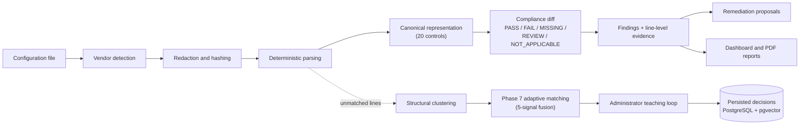
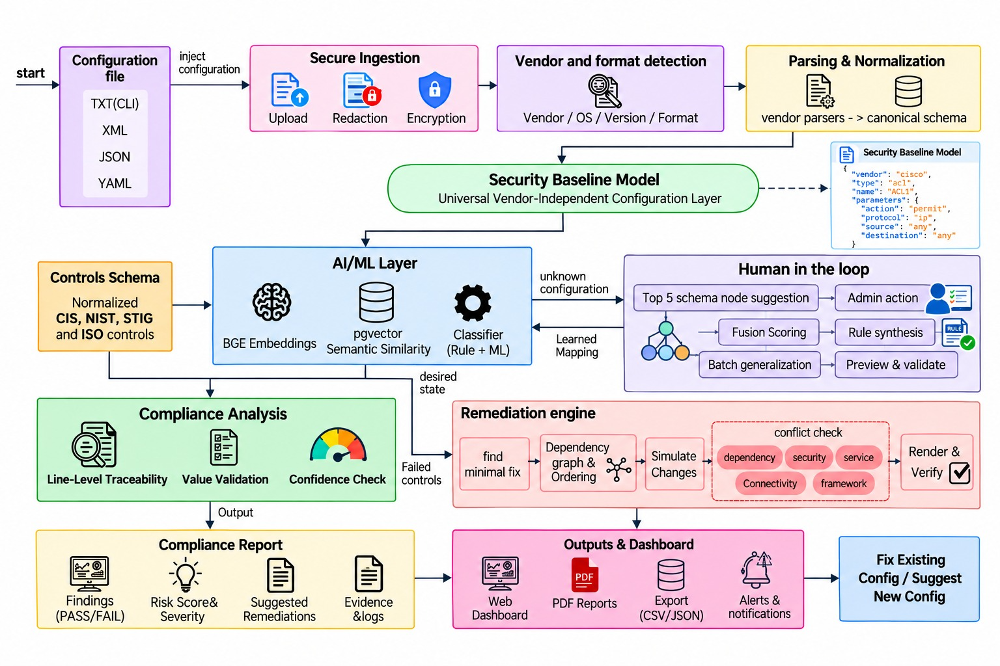
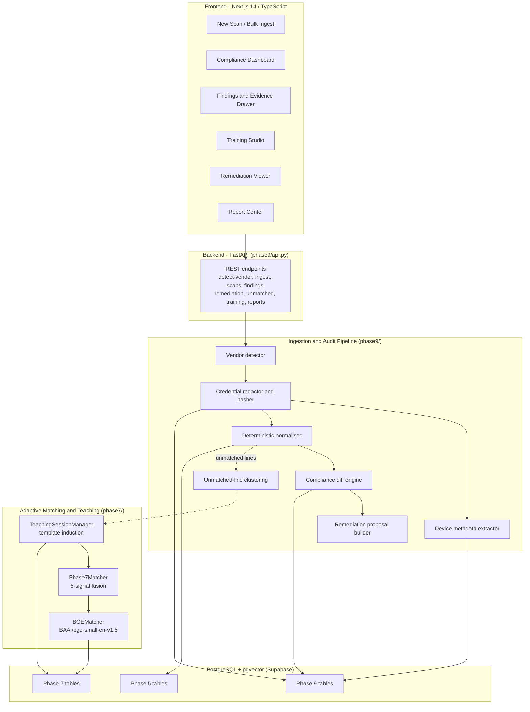
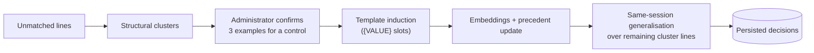
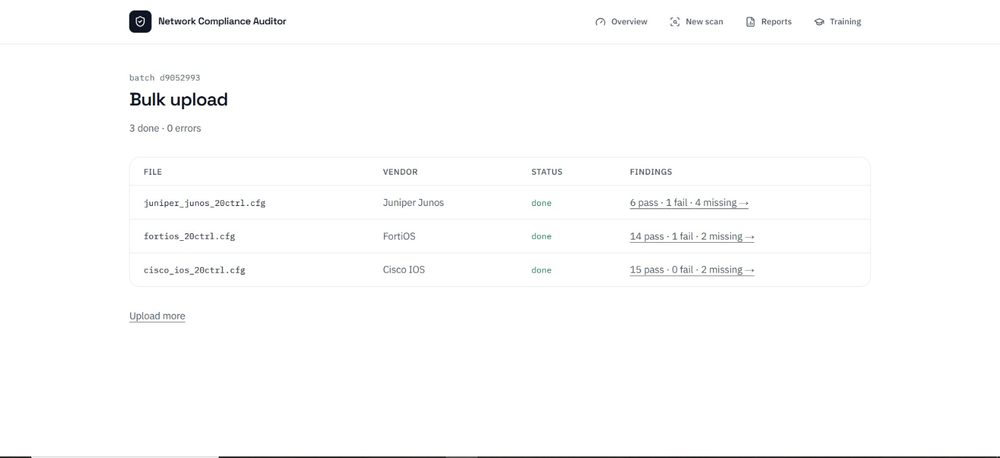
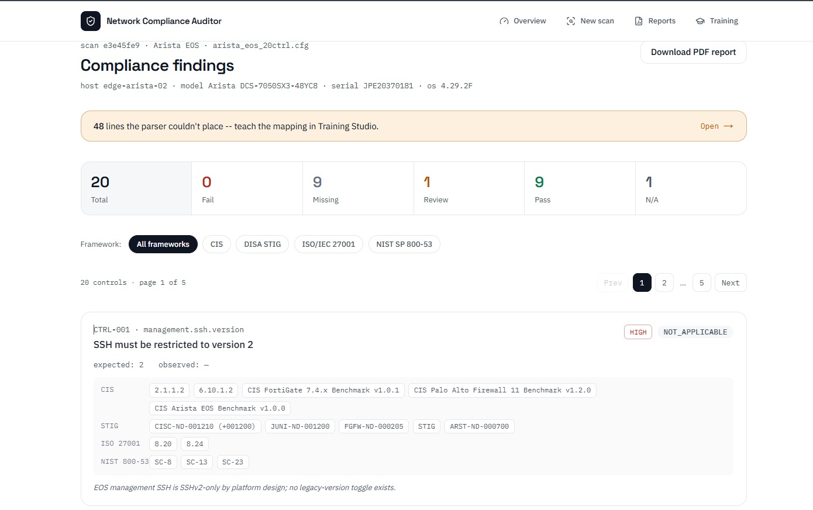

<div align="center">

# AI-Driven Multi-Vendor Network Security Compliance Auditor

**Smart India Hackathon 2026 · Problem Statement SIH26155 · Team Van_guard**

[](https://www.python.org/)
[](https://fastapi.tiangolo.com/)
[](https://nextjs.org/)
[](https://github.com/pgvector/pgvector)
[](#development-phases)

</div>

A **multi-vendor network security compliance auditor** that translates vendor-specific device configuration (Cisco IOS, Juniper Junos, Fortinet FortiOS, Palo Alto PAN-OS, Arista EOS) into a **common, vendor-independent set of 20 canonical security controls**, then evaluates each control against **CIS, DISA STIG, ISO/IEC 27001 and NIST SP 800-53** references with line-level evidence.

The system follows a **"deterministic first, adaptive second"** design. A rule-based parser and compliance engine produce every PASS / FAIL / MISSING / REVIEW / NOT_APPLICABLE decision it can. Only configuration lines the deterministic parser does **not** recognise are handed to an adaptive **multi-evidence matching layer** (five-signal fusion, negation gating, BGE + pgvector similarity, and an administrator teaching loop), so unknown syntax is neither silently ignored nor blindly guessed.

> **Honest status note.** This README is written against a source-level audit of the repository (audit date 2026-09-28). Everything described as implemented exists in the code. Pre-remediation conflict checking (Phase 8) is **planned, not implemented**, and the diagram in [System Architecture](#system-architecture) contains proposed components that are labelled as such.

---

## SIH Team Information

| Field | Details |
|---|---|
| Smart India Hackathon | 2026 |
| Problem Statement ID | SIH26155 |
| Problem Statement | AI-Driven Multi-Vendor Network Security Compliance Auditor |
| Theme | Blockchain & Cybersecurity |
| Category | Software |
| Team ID | 159596 |
| Team Name | Van_guard |

---

## Table of Contents

- [Problem Statement](#problem-statement)
- [Solution Overview](#solution-overview)
- [Key Features](#key-features)
- [System Architecture](#system-architecture)
- [End-to-End Workflow](#end-to-end-workflow)
- [Supported Vendors](#supported-vendors)
- [Compliance Frameworks](#compliance-frameworks)
- [AI and ML Architecture](#ai-and-ml-architecture)
- [Human-in-the-Loop Learning](#human-in-the-loop-learning)
- [Compliance Engine](#compliance-engine)
- [Dataset](#dataset)
- [Development Phases](#development-phases)
- [Phase 9 / Frontend Integration](#phase-9--frontend-integration)
- [Database Architecture](#database-architecture)
- [Technology Stack](#technology-stack)
- [Project Structure](#project-structure)
- [Installation](#installation)
- [Database Setup](#database-setup)
- [Running the Application](#running-the-application)
- [Running Tests](#running-tests)
- [Demo and Sample Outputs](#demo-and-sample-outputs)
- [Screenshots](#screenshots)
- [API Reference](#api-reference)
- [Implemented vs Planned](#implemented-vs-planned)
- [Security and Privacy](#security-and-privacy)
- [Known Limitations](#known-limitations)
- [Future Roadmap](#future-roadmap)
- [Contributors](#contributors)
- [SIH Project Information](#sih-project-information)

---

## Problem Statement

Enterprise and campus networks are rarely single-vendor. Each vendor uses its own operating system, syntax and configuration hierarchy, which makes security auditing hard to do consistently.

- **Syntax fragmentation.** A 15-minute idle timeout is `exec-timeout 15 0` under `line vty` on Cisco IOS, `set system login idle-timeout 15` on Junos, `set admintimeout 15` under `config system global` on FortiOS, and `set deviceconfig system idle-timeout 15` on PAN-OS. The *control* is identical; the *configuration* is not.
- **Fragmented compliance checking.** Auditing against CIS or STIG normally means writing and maintaining a separate rule set per vendor, or paying for proprietary tooling.
- **The unmatched-configuration gap.** Software upgrades, syntax variants and unmodelled directives slip past static regex matchers, leaving blind spots where security posture cannot be determined.
- **Risky manual remediation.** Applying fixes without understanding dependencies can lock administrators out of the management plane (for example, enabling AAA before credentials exist, or restricting VTY access with an ACL that excludes the administrator).
- **Opaque results.** Tools that output only a score, without the exact line, line number and framework rationale, are hard to trust and hard to act on.

A **vendor-agnostic canonical representation** addresses this by defining each security control once and mapping every vendor's syntax onto it, so one compliance rule set serves all vendors and every finding can be traced back to a specific configuration line.

---

## Solution Overview

The platform is a modular pipeline that ingests device configuration, normalises it into the canonical model, evaluates compliance deterministically, and routes unrecognised lines to an adaptive, human-supervised matching layer.


```mermaid
flowchart LR
    A["Configuration file"] --> B["Vendor detection"]
    B --> C["Redaction and hashing"]
    C --> D["Deterministic parsing"]
    D --> E["Canonical representation<br/>(20 controls)"]
    E --> F["Compliance diff<br/>PASS / FAIL / MISSING /<br/>REVIEW / NOT_APPLICABLE"]
    D -. "unmatched lines" .-> G["Structural clustering"]
    G --> H["Phase 7 adaptive matching<br/>(5-signal fusion)"]
    H --> I["Administrator teaching loop"]
    I --> J[("Persisted decisions<br/>PostgreSQL + pgvector")]
    F --> K["Findings + line-level evidence"]
    K --> L["Remediation proposals"]
    K --> M["Dashboard and PDF reports"]
```

1. **Ingestion and vendor detection.** Regex-signature scoring identifies the vendor and reports confidence (`high`, `low`, `ambiguous`, `undetected`); the user can override.
2. **Redaction.** Passwords, secrets, pre-shared keys, SNMP communities and TACACS/RADIUS keys are replaced with `***REDACTED***`, and SHA-256 hashes of original and sanitised text are recorded.
3. **Deterministic parsing.** Flat (Junos, PAN-OS) and block-structured (Cisco IOS, Arista EOS, FortiOS) configurations are parsed into canonical fields, respecting block context.
4. **Compliance evaluation.** Each of the 20 canonical controls is evaluated into one of five states, with the evidence line, line number, expected vs observed value and framework citations.
5. **Adaptive handling of unmatched lines.** Unrecognised lines are clustered by structural skeleton and scored by the Phase 7 engine; an administrator confirms mappings, from which a generalised template is induced.
6. **Remediation and reporting.** For FAIL, MISSING and REVIEW findings the system proposes vendor-specific remediation, rollback and verification commands, and produces PDF reports. Conflict checking before remediation is **not** implemented yet.

---

## Key Features

### Core Implemented Features

- **Vendor-agnostic canonical compliance representation** of 20 security controls with per-vendor command mappings (100 mappings = 20 controls × 5 vendors).
- **Multi-vendor configuration analysis** for Cisco IOS, Juniper Junos, Fortinet FortiOS, Palo Alto PAN-OS and Arista EOS, with vendor auto-detection and manual override.
- **Deterministic parsing** with block-aware and flat normalisers.
- **Five-state compliance evaluation** (`PASS`, `FAIL`, `MISSING`, `REVIEW`, `NOT_APPLICABLE`) with line-level traceability and CIS / STIG / ISO 27001 / NIST 800-53 citations.
- **PostgreSQL-backed compliance knowledge** (Supabase-hosted, with pgvector): controls, vendor mappings, remediation rules, dependency rules and a 1,096-record configuration corpus.
- **Leakage-free, configuration-level dataset split** (193 files: train 153 / validation 18 / test 22) with manifest and hash verification.
- **Credential sanitisation** before persistence, with SHA-256 provenance hashes.
- **Remediation proposals** with CLI commands, rollback commands, verification commands and parameter placeholders.
- **Dual PDF reporting** (Jinja2 + xhtml2pdf audit report; ReportLab device-tailored report) and **bulk multi-file ingestion**.
- **Web application** (Next.js 14) with dashboard, findings and evidence drawer, remediation viewer, report centre and Training Studio, served by a **FastAPI** backend.

### Adaptive / AI-Assisted Features

- **Phase 7 multi-evidence matching** with **five-signal evidence fusion** (syntax, context, value semantics, framework fit, precedent).
- **Context-aware matching** using the parser-derived configuration context path.
- **Value-semantic matching** (boolean, numeric, IP/CIDR, enum, string type inference).
- **Negation hard gate** that forces fusion score to 0 and routes to administrator review when polarity conflicts (for example `no ...` vs `...`).
- **Framework-fit scoring** that checks a candidate value against the control's operator and expected value.
- **Historical precedent** scoring from a persistent confirmation-frequency store.
- **BGE + pgvector semantic similarity** (`BAAI/bge-small-en-v1.5`, 384-d, cosine) for MEDIUM-confidence cases in the Phase 7 engine.
- **Human-in-the-loop teaching**, **template induction** (`{VALUE}` slots) and **same-session generalisation** across a cluster.
- **Persistent, explainable decisions**: every mapping decision stores its per-signal scores, fusion score and outcome.

> Phase 8 (dependency-graph conflict checking) is **not** part of the implemented feature set. See [Development Phases](#development-phases).

---

## System Architecture

The architecture diagram below presents the overall SIH solution and its major processing layers. It combines the implemented pipeline with planned extensibility; the implementation-status table immediately below distinguishes what is currently implemented from what remains planned.



*Figure: End-to-end architecture of the Multi-Vendor Network Security Compliance Auditor.*

> **Important:** the diagram shows the *intended* design. Not every block in it is implemented in the repository. The table after the diagram states, block by block, what exists today.

### Diagram blocks vs. current implementation

| Diagram block | Status in the repository |
|---|---|
| Configuration file (TXT/CLI) | Implemented for text/CLI configuration files. XML, JSON and YAML input are not part of the verified implementation. |
| Secure ingestion: upload, redaction | Implemented (upload endpoints, credential redaction, SHA-256 hashing). Encryption is not part of the verified implementation. |
| Vendor and format detection | Implemented for vendor detection with confidence; OS version, model, hostname and serial are extracted as device metadata. |
| Parsing and normalisation to canonical schema | Implemented. |
| Security Baseline Model (universal layer) | Implemented as the canonical model of 20 controls / canonical fields. The fine-grained ACL-parameter JSON shown in the diagram is illustrative. |
| Controls schema (CIS, NIST, STIG, ISO) | Implemented as framework citations on the 20 controls. |
| AI/ML layer: BGE embeddings, pgvector similarity | Implemented in the Phase 7 engine. In the current API runtime the BGE stage is not wired in (see [Known Limitations](#known-limitations)). |
| AI/ML layer: "Classifier (Rule + ML)" | No trained classifier exists. Matching is rule-based evidence fusion plus embedding similarity. |
| Human in the loop: admin action, fusion scoring, rule synthesis, batch generalisation | Implemented (Training Studio, template induction, same-session generalisation). A separate "top-5 schema node suggestion" and "preview and validate" step are not verified in the audit. |
| Compliance analysis: line-level traceability, value validation | Implemented. |
| Remediation engine: find minimal fix, render and verify | Implemented as per-control remediation, rollback and verification commands. Commands are proposed, not executed on devices. |
| Remediation engine: dependency graph and ordering, simulate changes, conflict check | **Planned (Phase 8), not implemented.** The API returns `conflict_check: "not_available"`. |
| Compliance report: findings, evidence, severity, suggested remediations | Implemented. A separate aggregate "risk score" is not verified. |
| Outputs: web dashboard, PDF reports | Implemented. |
| Outputs: CSV/JSON export, alerts and notifications | Not verified as implemented (the REST API returns JSON). |
| Fix existing config / suggest new config | Remediation commands are suggested; automatic configuration rewriting or deployment is not implemented. |

### Implemented architecture (Mermaid)


```mermaid
flowchart TD
    subgraph Client["Frontend - Next.js 14 / TypeScript"]
        UI_Upload["New Scan / Bulk Ingest"]
        UI_Dash["Compliance Dashboard"]
        UI_Find["Findings and Evidence Drawer"]
        UI_Train["Training Studio"]
        UI_Remed["Remediation Viewer"]
        UI_Rep["Report Center"]
    end

    subgraph API["Backend - FastAPI (phase9/api.py)"]
        EP["REST endpoints<br/>detect-vendor, ingest, scans, findings,<br/>remediation, unmatched, training, reports"]
    end

    subgraph Pipeline["Ingestion and Audit Pipeline (phase9/)"]
        V_Detect["Vendor detector"]
        Sanitize["Credential redactor and hasher"]
        Dev_Info["Device metadata extractor"]
        Norm["Deterministic normaliser"]
        Diff["Compliance diff engine"]
        Remed["Remediation proposal builder"]
        Cluster["Unmatched-line clustering"]
    end

    subgraph Phase7["Adaptive Matching and Teaching (phase7/)"]
        P7_Match["Phase7Matcher<br/>5-signal fusion"]
        P7_Teach["TeachingSessionManager<br/>template induction"]
        P7_BGE["BGEMatcher<br/>BAAI/bge-small-en-v1.5"]
    end

    subgraph Storage["PostgreSQL + pgvector (Supabase)"]
        DB_Found["Phase 5 tables"]
        DB_P7["Phase 7 tables"]
        DB_P9["Phase 9 tables"]
    end

    Client --> EP
    EP --> V_Detect --> Sanitize
    Sanitize --> Dev_Info
    Sanitize --> Norm --> Diff --> Remed
    Norm -. "unmatched lines" .-> Cluster -.-> P7_Teach
    P7_Teach --> P7_Match --> P7_BGE
    Diff --> DB_P9
    Sanitize --> DB_P9
    Dev_Info --> DB_P9
    P7_Teach --> DB_P7
    P7_BGE --> DB_P7
    Norm --> DB_Found
```

### Layer by layer

| # | Layer | What it does | Key code |
|---|---|---|---|
| 1 | **Configuration ingestion** | Accepts single or bulk text configuration uploads, decodes UTF-8, creates a scan record, and processes it as a background task. | `phase9/api.py`, `phase9/bulk_ingest.py` |
| 2 | **Vendor / format detection** | Scores the text against per-vendor regex signatures; returns vendor, confidence and candidates; supports user override. | `phase9/vendor_detect.py` |
| 3 | **Parsing and normalisation** | Flat parsing (Junos, PAN-OS) or block-aware parsing (Cisco IOS, Arista EOS, FortiOS); matched lines fill `NormalizedConfig`, others go to `unmatched`. | `phase9/normalizer.py`, `phase9/mapping_loader.py` |
| 4 | **Canonical security representation** | 20 canonical fields, each mapped from vendor syntax via `vendor_command_mappings`. | `mappings/vendor_mappings.json` |
| 5 | **Compliance / control layer** | 20 controls with operator, expected value, severity and CIS/STIG/ISO/NIST citations. | `controls/control_schema_cis_stig_iso27001.json` |
| 6 | **Deterministic compliance engine** | Evaluates each control to a five-state result with evidence. | `phase9/compliance_diff.py` |
| 7 | **Phase 7 adaptive matching** | Five-signal fusion, negation gate, confidence routing, BGE similarity. | `phase7/` |
| 8 | **Human-in-the-loop teaching** | Administrator confirms examples; template induced; remaining cluster lines generalised. | `phase7/teaching_session.py`, `phase7/template_induction.py`, `phase9/unmatched_clustering.py` |
| 9 | **Persistence** | PostgreSQL + pgvector for knowledge, teaching state, scans and findings. | `db/`, `phase9/repository.py`, `phase7/db_repository.py` |
| 10 | **Reporting / output** | Findings API, dashboard, remediation proposals, two PDF engines. | `phase9/remediation.py`, `phase9/report.py`, `phase9/dynamic_report.py` |

---

## End-to-End Workflow

What happens to one configuration file, from upload to output:

1. **(Optional) Pre-ingest preview.** The UI calls `POST /api/detect-vendor`; if confidence is `ambiguous` (for example Cisco IOS vs Arista EOS) the user confirms the vendor.
2. **Ingest.** The user selects frameworks (CIS, STIG, ISO 27001, NIST 800-53) and submits via `POST /api/ingest` or `POST /api/ingest/bulk`. A `scans` row is created with status `processing` and the API returns `scan_id` immediately.
3. **Vendor confirmation and redaction.** The vendor is confirmed or overridden. Secrets are redacted and SHA-256 hashes of original and sanitised text are computed; only the redacted text is stored in `device_configs`.
4. **Device metadata.** Hostname, model, serial number and OS version are extracted where present.
5. **Deterministic parsing.** Recognised lines are matched to canonical fields (respecting block context). Lines that do not match are collected as `unmatched`. **Recognised lines never enter Phase 7.**
6. **Compliance evaluation.** All 20 controls are evaluated into `PASS`, `FAIL`, `MISSING`, `REVIEW` or `NOT_APPLICABLE`; findings are bulk-inserted and the scan status becomes `done`.
7. **Unmatched lines to Phase 7.** In the Training Studio, unmatched lines are clustered by structural skeleton (IPs, numbers and identifiers masked) and scored by the Phase 7 engine, which generates five evidence signals and fuses them into a confidence score.
8. **Confidence routing (Phase 7 engine):**
   - **HIGH** (score ≥ 0.85): `AUTO_APPLY`, BGE bypassed.
   - **MEDIUM** (0.60 ≤ score < 0.85): BGE cosine similarity is checked; at or above the threshold the result is `BGE_RESOLVED`, otherwise `ADMIN_REVIEW`.
   - **LOW** (score < 0.60): `ADMIN_REVIEW`, BGE bypassed.
   - A negation conflict forces score 0, LOW, `ADMIN_REVIEW`.
   - *Current API runtime note:* the FastAPI layer instantiates the matcher with the BGE stage disabled, so MEDIUM-confidence lines currently go straight to `ADMIN_REVIEW`.
9. **Teaching loop.** After the administrator confirms 3 sample lines for a canonical field, a template is induced, confirmed examples are embedded, precedent counts are updated, and the remaining lines in the cluster are evaluated (same-session generalisation).
10. **Persistence.** Sessions, confirmed examples, templates, embeddings and per-decision scores are written to PostgreSQL.
11. **Remediation.** For FAIL, MISSING and REVIEW findings, `GET /api/remediation/{scan_id}/{control_id}` returns remediation, verification and rollback commands and placeholders; `conflict_check` is `"not_available"`.
12. **Reporting.** The administrator downloads the audit report (`GET /api/reports/{scan_id}/pdf`) or a device-tailored report (`POST /api/reports/{scan_id}/dynamic-pdf`).

---

## Supported Vendors

| Vendor / OS | Identifier | Parsing style | Repository status |
|---|---|---|---|
| Cisco IOS | `cisco_ios` | Block (indentation-based) | Implemented. In Phase 6 dataset splits. |
| Juniper Junos | `juniper_junos` | Flat (`set ...`) | Implemented. In Phase 6 dataset splits. |
| Fortinet FortiOS | `fortios` | Block (`config` / `edit` / `next` / `end`) | Implemented. In Phase 6 dataset splits. |
| Palo Alto PAN-OS | `panos` | Flat (`set ...`) | Implemented. In Phase 6 dataset splits. |
| Arista EOS | `arista_eos` | Block (indentation-based) | Implemented in detection, parsing and mappings; real sample configs included. **Held out of the Phase 6 splits** and reserved for live demonstration. |
| Check Point Gaia, VyOS, ArubaOS | none | none | **Planned**, not implemented. |

Each vendor has 20 command mappings and 20 remediation rules (100 of each in total).

---

## Compliance Frameworks

The repository implements a **canonical control set of 20 controls**. Every control carries citations to four frameworks:

| Framework | Representation |
|---|---|
| CIS Benchmarks | Recommendation IDs per control |
| DISA STIG | STIG IDs per control |
| ISO/IEC 27001 | Annex A clause references per control |
| NIST SP 800-53 | Control identifiers per control |

These are the **implemented control set**, not complete coverage of any framework. Because all 20 controls cite all four frameworks, selecting a subset of frameworks in the UI does not currently reduce the controls evaluated (see [Known Limitations](#known-limitations)).

---

## AI and ML Architecture

The AI/ML layer is **not a generic LLM chatbot**. It is a narrow, explainable matching system that only acts on configuration lines the deterministic parser could not recognise:

```text
Deterministic parser
   -> unmatched configuration line
      -> multi-evidence matching (5 signals, negation gate)
         -> confidence routing
            -> HIGH:   AUTO_APPLY
            -> MEDIUM: BGE similarity check (pgvector)
            -> LOW:    ADMIN_REVIEW
```

**Design principle: deterministic first, adaptive second.** No neural network is trained. Learning consists of storing administrator-confirmed examples, induced templates, embeddings and precedent counts.

### Five Evidence Signals

| Signal | Default weight | Logic | File |
|---|---|---|---|
| **Syntax** | 0.35 | `0.65 * structure_match + 0.35 * min(fixed_ratio, edit_ratio)` using `difflib.SequenceMatcher` against induced/confirmed templates | `phase7/template_induction.py` |
| **Context** | 0.15 | Hierarchical overlap of dot-delimited context paths: `common_parts / max(len(candidate), len(expected))` | `phase7/context_scorer.py` |
| **Value Semantics** | 0.25 | 1.0 if the inferred value type (boolean, numeric, ip, enum, string) matches the expected type, else 0.0 | `phase7/value_semantics.py` |
| **Framework Fit** | 0.15 | 1.0 if the value satisfies the control's operator and expected value, else 0.0 | `phase7/framework_fit.py` |
| **Precedent** | 0.10 | `log(1 + count) / log(1 + max_count)` over historical confirmations of the template | `phase7/precedent.py` |

Weights and thresholds are overridable through environment variables (see [Installation](#installation)).

**Dynamic renormalisation.** If a signal is unavailable (for example no context path), its weight is dropped and the remaining weights are rescaled so they still sum to 1:

```text
effective_weight_i = w_i / sum(w_k for k in available signals)
```

**Negation hard gate.** If the candidate contains negation tokens (`no`, `deny`, `disabled`, `disable`, `off`, `false`) that the confirmed examples do not (or vice versa), the fusion score is forced to `0.0`, the bucket to `LOW` and the decision to `ADMIN_REVIEW`.

### Confidence Routing

| Bucket | Score | Action |
|---|---|---|
| **HIGH** | ≥ 0.85 | `AUTO_APPLY` (BGE bypassed) |
| **MEDIUM** | 0.60 ≤ score < 0.85 | BGE similarity check; `BGE_RESOLVED` if similarity ≥ threshold, otherwise `ADMIN_REVIEW` |
| **LOW** | < 0.60 | `ADMIN_REVIEW` (BGE bypassed) |

### BGE Similarity Stage

| Property | Value |
|---|---|
| Model | `BAAI/bge-small-en-v1.5` (via `sentence-transformers`) |
| Embedding dimension | 384, unit-normalised |
| Store | PostgreSQL + pgvector, table `phase7_embedding_records` |
| Index | HNSW with `vector_cosine_ops` |
| Similarity | Cosine similarity, `1 - (embedding <=> target)` |
| Calibrated threshold | 0.75 (`BGE_SIMILARITY_THRESHOLD`) |
| What is embedded | Only administrator-confirmed examples |

The BGE stage is only invoked for MEDIUM-confidence cases. It is implemented and tested in the standalone Phase 7 engine; the current API runtime does not yet enable it (see [Known Limitations](#known-limitations)).

---

## Human-in-the-Loop Learning

Unmatched configuration lines are not guessed at; they are put in front of an administrator, and each confirmation makes the system better at the *next* line of the same pattern.


```mermaid
flowchart LR
    A["Unmatched lines"] --> B["Structural clusters"]
    B --> C["Administrator confirms<br/>3 examples for a control"]
    C --> D["Template induction<br/>({VALUE} slots)"]
    D --> E["Embeddings + precedent update"]
    E --> F["Same-session generalisation<br/>over remaining cluster lines"]
    F --> G[("Persisted decisions")]
```

| Element | Role |
|---|---|
| **Structural clustering** | Groups unmatched lines by a skeleton in which dynamic values (IPs, numbers, identifiers) are masked, so one confirmation covers a whole family of lines. |
| **Administrator confirmation** | The administrator accepts, modifies or rejects a proposed mapping to a canonical field in the Training Studio. A minimum of **3 confirmed examples** is required to trigger induction. |
| **Template induction** | Confirmed lines are aligned with `difflib.SequenceMatcher`. Tokens common to all examples are kept; divergent tokens become a `{VALUE}` slot (for example `set system services ssh protocol-version {VALUE}`). |
| **Learned mappings** | Induced templates are stored per vendor and canonical field with their example counts. |
| **Embeddings** | Confirmed examples are embedded with BGE (384-d) and stored in pgvector for later similarity checks. |
| **Precedent** | Confirmation frequency for each template is incremented and feeds the Precedent signal. |
| **Same-session generalisation** | Once the template exists, the remaining unmatched lines in the cluster are evaluated immediately and decisions recorded. |
| **Persistence** | Sessions, examples, templates, embeddings and decisions are stored in PostgreSQL and survive server restarts. Teaching sessions are **per cluster**, which prevents templates for one control from polluting another. |

This is **not autonomous model training**. No neural model is fine-tuned; the system accumulates verified examples, templates and precedent that are used as evidence in later matching.

---

## Compliance Engine

Compliance decisions come from the **deterministic** engine in `phase9/compliance_diff.py`; the adaptive Phase 7 layer only helps recognise lines and never overrides the deterministic result on its own.

**How a decision is produced**

1. The normaliser maps recognised lines to canonical fields, recording line number, raw line, extracted value and block context.
2. For each of the 20 controls, the engine compares the observation with the control's expected value using its operator (`eq`, `lte`, `gte`, `ne`) and the vendor's known pass/fail syntax from `vendor_command_mappings`.
3. A state is assigned and evidence, severity and framework citations are attached.

| State | Meaning |
|---|---|
| `PASS` | The line matches the known-good syntax, or the parsed value satisfies the operator. |
| `FAIL` | The line matches known non-compliant syntax, or the value violates the operator. |
| `MISSING` | No directive for the canonical field was found. |
| `REVIEW` | Syntax was recognised but the value cannot be evaluated deterministically and needs human inspection. |
| `NOT_APPLICABLE` | The platform has no toggle and is compliant by design (for example PAN-OS supports only SSHv2). |

**What each finding carries:** control ID, canonical field, state, severity, expected and observed value, evidence line and line number, block context, framework citations, linked (dependency) controls, and notes. Dependency information is stored (36 rules: `requires`, `enables`, `conflicts_with`, `shares_path_with`) and surfaced as linked controls, but it is **not yet used to check remediation conflicts** (Phase 8).

**Remediation.** For FAIL, MISSING and REVIEW findings, `phase9/remediation.py` returns vendor-specific remediation commands, a verification command, rollback commands and placeholders such as `<MGMT_SUBNET>` or `<NTP_SERVER_IP>`. Every proposal states `conflict_check: "not_available"`.

### The 20 canonical controls

| ID | Canonical field | Requirement | Severity |
|---|---|---|---|
| CTRL-001 | `management.ssh.version` | SSH restricted to version 2 | high |
| CTRL-002 | `management.telnet.enabled` | Telnet disabled | high |
| CTRL-003 | `management.http.enabled` | Unencrypted HTTP management disabled | high |
| CTRL-004 | `management.https.enabled` | HTTPS management enabled | medium |
| CTRL-005 | `management.session.idle_timeout_minutes` | Idle timeout ≤ 15 minutes | medium |
| CTRL-006 | `management.aaa.enabled` | AAA authentication enabled | high |
| CTRL-007 | `management.password.strong_policy_enabled` | Strong password encryption / algorithm | high |
| CTRL-008 | `management.login.max_failed_attempts` | Lockout after ≤ 5 failed attempts | medium |
| CTRL-009 | `management.logging.enabled` | Local logging enabled | medium |
| CTRL-010 | `management.logging.remote_syslog_configured` | Remote syslog host configured | high |
| CTRL-011 | `management.ntp.configured` | NTP server configured | medium |
| CTRL-012 | `management.ntp.authentication_enabled` | NTP authentication enabled | medium |
| CTRL-013 | `management.snmp.secure_configuration` | Insecure SNMP (v1/v2c, default community) disabled | high |
| CTRL-014 | `interfaces.unused_ports_disabled` | Unused interfaces shut down | low |
| CTRL-015 | `management.acl.configured` | Management access restricted by ACL | high |
| CTRL-016 | `routing.protocol_authentication_enabled` | Routing protocols authenticate | high |
| CTRL-017 | `management.admin_access.restricted` | Management restricted to trusted hosts | high |
| CTRL-018 | `management.banner.configured` | Legal warning banner configured | low |
| CTRL-019 | `management.crypto.weak_algorithms_disabled` | Weak ciphers / key exchange disabled | high |
| CTRL-020 | `management.protocols.insecure_disabled` | Insecure legacy protocols (CDP/TFTP) disabled | medium |

---

## Dataset

The dataset combines **real-world sanitised configurations** and a **synthetic dataset** (a golden compliant baseline per vendor plus mutated files labelled `PASS`, `FAIL` or `MISSING` per control). Metadata for **1,096** configuration files is loaded into the `config_corpus` table.

### Split methodology

`phase6/split_dataset.py` splits **whole configuration files (device level), not individual lines**.

**Why not line-level splitting?** Configurations from the same device share most of their lines. A line-level split would place near-identical lines in both training and test data, so evaluation would measure memorisation instead of generalisation. File-level grouping keeps related content on one side of the split.

Leakage-prevention rules:

- **Stratification:** all four split vendors (Cisco IOS, Juniper Junos, Fortinet FortiOS, Palo Alto PAN-OS) appear in train, validation and test.
- **Golden baselines pinned to train:** every vendor's PASS file derives from the same device baseline and is byte-identical in content, so holding one out would leak content.
- **Grouping:** non-PASS files are grouped by `(vendor, control_id)` and content hash; files with identical content stay in the same split.
- **Integrity exclusions:** Phase 4 generated 195 synthetic files; `panos/CTRL-001/PASS` and `panos/CTRL-002/PASS` were excluded after Phase 5 referential-integrity checks (single-state controls for PAN-OS), leaving **193**.

### Distribution

| Partition | Files | Share | FAIL | MISSING | PASS | Distinct hashes |
|---|---|---|---|---|---|---|
| **Train** | 153 | 79.27% | 27 | 48 | 78 | 76 |
| **Validation** | 18 | 9.33% | 8 | 10 | 0 | 18 |
| **Test** | 22 | 11.40% | 6 | 16 | 0 | 22 |
| **Total** | **193** | 100% | 41 | 74 | 78 | 116 |

| Vendor | Train | Validation | Test | Total |
|---|---|---|---|---|
| Cisco IOS | 42 | 5 | 5 | 52 |
| Fortinet FortiOS | 41 | 6 | 6 | 53 |
| Juniper Junos | 36 | 3 | 6 | 45 |
| Palo Alto PAN-OS | 34 | 4 | 5 | 43 |

Arista EOS is intentionally excluded from the splits and reserved for live demonstration.

### Verification

- `phase6/phase6_dataset/split_manifest.csv` lists every file with its SHA-256 and label; `split_report.json` records stratification metrics and the leakage audit.
- `phase6/test_split.py` (18 tests) verifies **0 shared file keys, 0 shared SHA-256 hashes and 0 shared control groups** across splits, and checks saved files against the manifest hashes.

---

## Development Phases

| Phase | Title | Status | Description |
|---|---|---|---|
| 1–4 | Foundations and data assets | ✅ Complete | Canonical control schema (20 controls, CIS/STIG/ISO/NIST citations), vendor command mappings (100), remediation rules (100), dependency rules (36), and the real and synthetic configuration corpus (Phase 4 generated 195 synthetic files). |
| 5 | Database foundation | ✅ Complete | PostgreSQL/Supabase schema, data loaders, and 26 automated referential-integrity checks. |
| 6 | Leakage-free dataset split | ✅ Complete | Device-level, stratified train/validation/test split of 193 files with manifest, hash checks and leakage tests. |
| 7 | Multi-evidence adaptive matching and teaching loop | ✅ Complete | Five-signal fusion, negation gate, confidence routing, BGE + pgvector similarity, template induction and same-session generalisation. 34/34 tests pass. |
| 8 | Pre-remediation conflict checking | 🕓 Planned, **not implemented** | Would run graph analysis (cycle detection, topological ordering, simulation) over the 36 dependency rules to prevent management lockout. Only the rule data exists today. |
| 9 | Ingestion, API, reports and web UI | ✅ Complete | FastAPI backend, vendor detection, sanitiser, normaliser, compliance diff, clustering, dual PDF reports, bulk ingestion and Next.js frontend. |

> The per-phase breakdown of Phases 1–4 is summarised in one row because the source audit reports them together as the foundation layer.

---

## Phase 9 / Frontend Integration

Phase 9 integrates the compliance engine and adaptive matching capabilities into the usable application layer.

### Implemented Components

- **FastAPI backend** with REST endpoints for vendor detection, single/bulk ingestion, scans, findings, remediation, unmatched lines, training decisions and PDF reports.
- **Vendor detection and manual override** with confidence and candidate reporting.
- **Credential sanitisation** before configuration persistence, with SHA-256 provenance hashes.
- **Device metadata extraction** for hostname, model, serial number and OS version where present.
- **Deterministic normalisation and compliance diff** across the 20 canonical controls.
- **Unmatched-line clustering** for the Phase 7 Training Studio.
- **Remediation proposals** containing vendor-specific commands, verification commands, rollback commands and parameter placeholders.
- **Dual PDF reporting** using the audit-report and device-tailored report pipelines.
- **Bulk multi-device ingestion** with batch tracking.
- **Next.js 14 frontend** providing the dashboard, findings/evidence view, remediation viewer, report centre and Training Studio.

### Phase 9 Verification

The audit verifies the Phase 9 implementation through source inspection and the associated unit/integration test suites. The repository also contains the five-vendor demonstration workflow under `demo/`.

> **Current boundary:** Phase 9 exposes remediation proposals but does not execute changes on network devices. Pre-remediation dependency conflict checking remains a Phase 8 roadmap item.

---

## Database Architecture

PostgreSQL 17.6 hosted on **Supabase**, with the **pgvector** extension (0.8.2) for embedding storage and similarity search. Access is through SQLAlchemy 2.0 Core with the `psycopg2` driver.

### Phase 5 foundation tables

| Table | Purpose | Rows loaded |
|---|---|---|
| `compliance_controls` | Master definitions of the canonical controls: canonical field, operator, expected value, severity, CIS / STIG / ISO 27001 / NIST 800-53 citations. | 20 |
| `vendor_command_mappings` | Per-vendor syntax for each control: context path, pass line, fail line, match regex, tri-state flags. | 100 |
| `remediation_rules` | Remediation commands, verification command and rollback commands per vendor and control. | 100 |
| `config_dependency_rules` | Relationships between controls (`requires`, `enables`, `conflicts_with`, `shares_path_with`); reserved for Phase 8 conflict checking. | 36 |
| `config_corpus` | Metadata of real and synthetic configuration files: path, vendor, source type, SHA-256, state, label confidence. | 1,096 |

### Phase 7 adaptive / teaching tables

| Table | Purpose |
|---|---|
| `phase7_teaching_sessions` | State of each administrator teaching session (vendor, state, confirmations, learned template). |
| `phase7_confirmed_examples` | Lines the administrator confirmed for a canonical field, with template signature and context path. |
| `phase7_learned_templates` | Induced templates with `{VALUE}` slots, per vendor and control, with example counts. |
| `phase7_embedding_records` | 384-d BGE embeddings (`vector(384)`) of confirmed examples, with an HNSW cosine index. |
| `phase7_mapping_decisions` | Explainable audit log of every decision: candidate field, per-signal scores, fusion score and outcome. |

### Phase 9 application tables

| Table | Purpose |
|---|---|
| `batches` | Tracks bulk upload batches. |
| `scans` | One row per scan: filename, vendor, status, vendor confidence and candidates, device metadata (hostname, model, serial, OS version), frameworks selected. |
| `device_configs` | Redacted configuration text plus SHA-256 hashes of original and sanitised text and redaction counts. |
| `findings` | Per-control results: state, severity, observed value, evidence line and number, framework citations. |

---

## Technology Stack

| Layer | Technology | Purpose |
|---|---|---|
| Language | Python (3.13 recommended) | Backend, parsing, matching, tooling |
| Backend framework | FastAPI `>=0.110`, Uvicorn `>=0.29` | REST API and ASGI server |
| Database | PostgreSQL 17.6 on Supabase | Persistent storage |
| Vector search | pgvector `>=0.3` (0.8.2 in DB) | Embedding storage, HNSW cosine search |
| DB access | SQLAlchemy `>=2.0`, psycopg2-binary `>=2.9`, python-dotenv | Queries, connection and configuration |
| Embeddings | sentence-transformers `>=3.0`, `BAAI/bge-small-en-v1.5` | 384-d semantic embeddings |
| Validation | Pydantic v2, jsonschema `>=4.0` | Models and JSON-schema validation of rule files |
| Data processing | pandas `>=2.0` | Dataset splitting (Phase 6) |
| Reporting | Jinja2 `>=3.1`, xhtml2pdf `>=0.2.16`, ReportLab `>=4.0` | Two PDF report engines |
| Testing | pytest `>=8.0` | Unit, integration and integrity tests |
| Frontend | Next.js 14.2.5 (App Router), React 18.3.1, TypeScript 5.5.4 | Web application |
| Styling | Tailwind CSS 3.4.7, Lucide React | UI theme and icons |

Template induction (`difflib`) and IP/CIDR value inference (`ipaddress`) use the Python standard library.

---

## Project Structure

```text
.
├── configs/                  # Real (sanitised) and synthetic configuration corpus
│   ├── real/                 #   real_data/<vendor>/ + provenance metadata
│   └── synthetic/            #   baseline/, synthetic_dataset/ (labelled PASS/FAIL/MISSING)
├── controls/                 # control_schema_cis_stig_iso27001.json (20 canonical controls)
├── mappings/                 # vendor_mappings.json (100 command mappings)
├── remediation/              # remediation_rules.json (100 remediation rules)
├── dependencies/             # config_dependency_rules.json (36 rules, used by Phase 8 plan)
├── schemas/                  # JSON Schemas validating the rule files
├── db/                       # DDL, migrations (Phase 5/7/9), loaders, integrity_check.py
├── phase6/                   # Leakage-free split: split_dataset.py, test_split.py, phase6_dataset/
├── phase7/                   # Adaptive matching engine and teaching loop (+ 34 tests)
├── phase9/                   # FastAPI app, vendor detection, sanitiser, normaliser,
│                             #   compliance diff, remediation, clustering, PDF reports (+ tests)
├── frontend/                 # Next.js 14 web application (app/, lib/api.ts)
├── docs/
│   ├── assets/
│   │   └── architecture.png # SIH system architecture diagram
│   └── screenshots/
│       ├── dashboard.png
│       └── compliance-results.png
├── demo/                     # run_5vendor_demo.sh
├── tests/                    # Phase 5 integrity and report tests
├── vendor_matrix_test.py     # End-to-end acceptance test across 5 vendors
├── training_test.py          # Teaching-loop verification across 5 vendors
├── requirements-phase7.txt
├── requirements-phase9.txt
└── report.pdf                # Sample generated compliance report
```

---

## Installation

### Prerequisites

| Requirement | Version |
|---|---|
| Python | 3.10+ (3.13 recommended) |
| Node.js / npm | Node 18+ / npm 9+ |
| PostgreSQL with pgvector | PostgreSQL 17 (or a Supabase project) |
| Git | any recent version |

### Clone and Python Environment

```bash
git clone https://github.com/Krithi777/Multi-Vendor-Network-Compliance-Auditor.git
cd Multi-Vendor-Network-Compliance-Auditor

python -m venv venv

## Linux / macOS
source venv/bin/activate

## Windows PowerShell
## .\venv\Scripts\Activate.ps1

python -m pip install --upgrade pip
python -m pip install -r requirements-phase7.txt
python -m pip install -r requirements-phase9.txt
python -m pip install pandas python-dotenv
```

> **Windows tip:** one Phase 6 test compares file hashes with the manifest and can fail if Git converts LF to CRLF. Configure Git to preserve LF line endings before cloning if you need to reproduce the dataset hash checks exactly.

## Environment Configuration

Create the local environment file from the supplied template:

```bash
cp .env.example .env
```

On Windows PowerShell, copy the file with:

```powershell
Copy-Item .env.example .env
```

Set `DATABASE_URL` and any optional Phase 7/frontend variables listed in the [environment variable table](#environment-variables). **Never commit `.env` or real credentials to Git.**

### Environment variables

| Variable | Required | Purpose |
|---|---|---|
| `DATABASE_URL` | Yes (live DB) | `postgresql+psycopg2://postgres:<PASSWORD>@<HOST>:5432/postgres` |
| `DRY_RUN` | No | `true`/`1` runs loaders in validation-only mode |
| `STRICT_INTEGRITY` | No | `1` escalates integrity warnings to test failures |
| `FUSION_SYNTAX_WEIGHT` / `FUSION_CONTEXT_WEIGHT` / `FUSION_VALUE_WEIGHT` / `FUSION_FRAMEWORK_WEIGHT` / `FUSION_PRECEDENT_WEIGHT` | No | Override fusion weights (defaults 0.35 / 0.15 / 0.25 / 0.15 / 0.10) |
| `HIGH_THRESHOLD` / `MEDIUM_THRESHOLD` | No | Confidence thresholds (defaults 0.85 / 0.60) |
| `BGE_MODEL` | No | Embedding model ID (default `BAAI/bge-small-en-v1.5`) |
| `BGE_SIMILARITY_THRESHOLD` | No | Cosine threshold for the BGE gate (default 0.75) |
| `NEXT_PUBLIC_API_BASE` | No | Backend URL used by the frontend (default `http://localhost:8000`) |

---

## Database Setup

Apply the migrations **in this order** (with `psql` or the Supabase SQL editor), then load the data:

```bash
## a. db/ddl.sql                    Phase 5 tables
## b. db/phase7_migration.sql       Phase 7 tables + pgvector
## c. db/phase9_migration.sql       scans, device_configs, findings
## d. db/phase9_migration_v2.sql    device metadata columns, batches table
## e. db/phase9_migration_v3.sql    frameworks_scanned column

## Load data (from the repository root)
python db/load_controls.py
python db/load_vendor_mappings.py
python db/load_remediation_rules.py
python db/load_dependency_rules.py
python db/load_config_corpus.py

## Verify referential integrity
python db/integrity_check.py
```

---

## Backend Setup

From the repository root with the virtual environment active:

```bash
python -m uvicorn phase9.api:app --reload --host 0.0.0.0 --port 8000
```

Verify the backend:

```bash
curl http://localhost:8000/api/health
```

Expected response:

```json
{"status": "ok"}
```

Swagger UI: `http://localhost:8000/docs`  
ReDoc: `http://localhost:8000/redoc`

## Frontend Setup

Install the frontend dependencies once from the repository root:

```bash
cd frontend
npm install
```

## Running the Application

### Terminal 1 — Backend

From the repository root with the virtual environment active:

```bash
python -m uvicorn phase9.api:app --reload --host 0.0.0.0 --port 8000
```

### Terminal 2 — Frontend

```bash
cd frontend
npm run dev
```

Open `http://localhost:3000`.

---

## Running Tests

| Suite | Command | Result recorded in the audit |
|---|---|---|
| Phase 7 matcher (34 tests) | `python -m pytest phase7/tests` | **34 passed** |
| Phase 6 dataset split (18 tests) | `python -m pytest phase6/test_split.py` | 15 passed, 2 skipped (need Phase 4 raw source), 1 Windows CRLF hash-check note |
| Phase 9 unit tests (20 tests) | `python -m pytest phase9/tests/test_device_info.py phase9/tests/test_normalizer.py phase9/tests/test_unmatched_clustering.py` | 18 passed, 2 skipped (Arista EOS held out of the test split) |
| PDF assembly (DB mocked) | `python -m pytest tests/test_report.py` | Available |
| Phase 5 integrity (26 checks, needs live `DATABASE_URL`) | `python -m pytest tests/test_phase5_integrity.py -v` | Database validated by 26 automated checks |

---

## Demo and Sample Outputs

**Automated five-vendor demo** (backend running on `localhost:8000`):

```bash
bash demo/run_5vendor_demo.sh
python vendor_matrix_test.py        # end-to-end acceptance test across the five vendors
```

**UI walkthrough**

1. Open `http://localhost:3000` and drop a file from `configs/real/real_data/cisco_ios/`.
2. Check the vendor-detection preview, then click **Start Compliance Scan**.
3. On `/findings/{scan_id}`, review the 20 control results and open the evidence drawer on a FAIL or MISSING control.
4. Click **Remediate** to see commands with placeholder substitution.
5. Open the **Training Studio** (`/training/{scan_id}`), confirm 3 sample lines from a cluster and watch template induction and generalisation.
6. Download the PDF report from the Report Center.

**Sample input files** are provided for every vendor under `configs/real/real_data/` (`cisco_ios`, `juniper_junos`, `fortios`, `panos`, `arista_eos`).

**Sample remediation response** (`GET /api/remediation/{scan_id}/CTRL-001`; illustrative example of the response shape):

```json
{
  "control_id": "CTRL-001",
  "canonical_field": "management.ssh.version",
  "vendor": "cisco_ios",
  "commands": ["configure terminal", "ip ssh version 2", "end", "write memory"],
  "verification_command": "show ip ssh",
  "rollback_commands": ["configure terminal", "no ip ssh version", "end"],
  "conflict_check": "not_available"
}
```

A sample generated report is included as `report.pdf`.

---

## API Reference

| Method | Path | Purpose |
|---|---|---|
| `GET` | `/api/health` | Liveness probe |
| `GET` | `/api/controls` | List the 20 canonical controls |
| `POST` | `/api/detect-vendor` | Stateless vendor detection preview (multipart `file`) |
| `POST` | `/api/ingest` | Upload one configuration and enqueue a scan |
| `POST` | `/api/ingest/bulk` | Upload multiple configurations as a batch |
| `GET` | `/api/scans` | List scans (filter by `vendor`, `batch_id`) |
| `GET` | `/api/scans/{scan_id}` | Scan status and device metadata |
| `GET` | `/api/findings/{scan_id}` | Summary counts and the 20 control findings |
| `GET` | `/api/remediation/{scan_id}/{control_id}` | Remediation, verification and rollback commands |
| `GET` | `/api/unmatched/{scan_id}` | Structural clusters of unmatched lines |
| `POST` | `/api/training/{scan_id}/decision` | Submit administrator confirmation or rejection |
| `GET` | `/api/reports/{scan_id}/pdf` | Audit report (Jinja2 + xhtml2pdf) |
| `POST` | `/api/reports/{scan_id}/dynamic-pdf` | Device-tailored report (ReportLab) |

---

## Screenshots

The following screenshots show the implemented web application workflow.

### Dashboard



*Figure: Dashboard showing bulk configuration ingestion and multi-device scan status.*

### Compliance Results



*Figure: Compliance findings with the 20-control breakdown and scan results.*


## Implemented vs Planned

Status reflects the repository audit dated 2026-09-28.

| Feature | Status |
|---|---|
| Multi-vendor ingestion (5 vendors) and vendor auto-detection | ✅ Implemented |
| Credential sanitisation with SHA-256 provenance | ✅ Implemented |
| Canonical taxonomy of 20 controls (CIS, STIG, ISO 27001, NIST 800-53 citations) | ✅ Implemented |
| Deterministic normaliser and five-state compliance diff | ✅ Implemented |
| Leakage-free dataset split | ✅ Implemented |
| Phase 7 five-signal fusion, negation gate, confidence routing | ✅ Implemented |
| BGE + pgvector similarity gate | ✅ Implemented in the Phase 7 engine; ⚠️ not enabled in the API runtime |
| Interactive teaching loop and template induction | ✅ Implemented |
| Unmatched-line clustering | ✅ Implemented |
| Remediation, rollback and verification commands | ✅ Implemented |
| Dual PDF reporting, bulk ingestion, Next.js web UI | ✅ Implemented |
| Pre-remediation conflict checking (dependency graph, simulation) | 🕓 Planned (Phase 8) |
| Additional vendors (Check Point Gaia, VyOS, ArubaOS) | 🕓 Planned |
| Air-gapped offline bundle | 🕓 Planned |

---

## Security and Privacy

- **Secrets in the repository.** `.env` is git-ignored; `.env.example` contains placeholders only.
- **At-rest sanitisation.** Configurations are redacted before being stored in `device_configs`; the raw text is not persisted. Evidence lines that contain sensitive tokens (for example TACACS+ keys or SNMP communities) are redacted before being stored or rendered in reports.
- **Provenance.** SHA-256 hashes of original and sanitised configuration are recorded.
- **CORS.** The API currently allows all origins (`allow_origins=["*"]`). This suits local development and demonstration and should be restricted to trusted origins before any production deployment.
- **Remediation is advisory.** The system proposes commands; it does not push changes to devices, and conflict checking is not yet available, so proposals should be reviewed before use.

---

## Known Limitations

1. **Phase 8 not implemented.** Remediation proposals report `conflict_check: "not_available"`.
2. **BGE stage not enabled in the API runtime.** The API creates the matcher without BGE, so MEDIUM-confidence matches currently route to `ADMIN_REVIEW`. The stage is implemented and tested in the standalone engine.
3. **Teaching session pointers are in memory.** Cluster-to-session mappings and the decision log in `phase9/api.py` reset on restart; the underlying teaching data persists in PostgreSQL.
4. **Framework selection does not narrow the audit.** All 20 controls cite all four frameworks, so all 20 are always evaluated.
5. **Windows line endings.** One Phase 6 hash test fails when Git converts LF to CRLF.
6. **Arista EOS is outside the Phase 6 splits**, although it is fully supported by the detector, normaliser and mappings.

---

## Future Roadmap

1. **Phase 8 execution engine:** directed-graph traversal over `config_dependency_rules`, cycle detection and topological ordering, and detection of management-lockout conditions before remediation.
2. **Persistent teaching join index:** move in-memory cluster/session mappings and the decision log into the database.
3. **Enable the BGE fallback in the API:** wire `bge_matcher` into `phase9/api.py` so MEDIUM-confidence matches can resolve against historical precedent embeddings.
4. **Additional vendor parsers:** Check Point Gaia, VyOS and ArubaOS.
5. **Air-gapped offline distribution.**

---

<div align="center">

**Smart India Hackathon 2026 · SIH26155 · Team Van_guard (ID 159596)**

</div>

---

## Contributors

**Team Van_guard · Smart India Hackathon 2026**

The project was developed collaboratively by Team Van_guard for Smart India Hackathon 2026.

> Add the official SIH team-member names and contribution areas here before final submission, using the exact details from the team's official SIH record.

---

## SIH Project Information

| Field | Details |
|---|---|
| Smart India Hackathon | 2026 |
| Problem Statement ID | SIH26155 |
| Problem Statement | AI-Driven Multi-Vendor Network Security Compliance Auditor |
| Theme | Blockchain & Cybersecurity |
| Category | Software |
| Team ID | 159596 |
| Team Name | Van_guard |

<div align="center">

**Smart India Hackathon 2026 · SIH26155 · Team Van_guard (ID 159596)**

</div>
