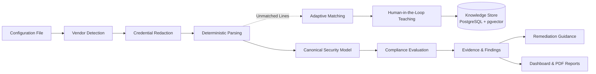
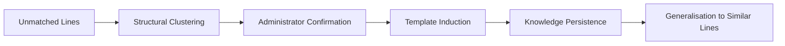

<div align="center">

# AI-Driven Multi-Vendor Network Security Compliance Auditor

**Smart India Hackathon 2026 · Problem Statement SIH26155 · Team Van_guard**

[](https://www.python.org/)
[](https://fastapi.tiangolo.com/)
[](https://nextjs.org/)
[](https://github.com/pgvector/pgvector)

</div>

A **multi-vendor network security compliance auditor** that translates configurations from **Cisco IOS, Juniper Junos, Fortinet FortiOS, Palo Alto PAN-OS and Arista EOS** into a common, vendor-independent representation of **20 canonical security controls**.

The platform evaluates configurations against references from **CIS, DISA STIG, ISO/IEC 27001 and NIST SP 800-53**, provides line-level evidence, and generates actionable remediation guidance.

The core design follows a **"deterministic first, adaptive second"** approach: known syntax is handled through deterministic parsing and compliance rules, while previously unrecognised syntax can be analysed through an adaptive multi-evidence matching layer and a human-in-the-loop teaching workflow.

---

## Smart India Hackathon 2026

| Field | Details |
|---|---|
| Smart India Hackathon | 2026 |
| Problem Statement ID | SIH26155 |
| Problem Statement | AI-Driven Multi-Vendor Network Security Compliance Auditor |
| Theme | Blockchain & Cybersecurity |
| Category | Software |
| Team ID | 159596 |
| Team Name | Van_guard |

---

## Table of Contents

- [Problem Statement](#problem-statement)
- [Our Solution](#our-solution)
- [Key Features](#key-features)
- [System Architecture](#system-architecture)
- [End-to-End Workflow](#end-to-end-workflow)
- [Supported Vendors](#supported-vendors)
- [Compliance Frameworks](#compliance-frameworks)
- [AI-Assisted Adaptive Matching](#ai-assisted-adaptive-matching)
- [Human-in-the-Loop Learning](#human-in-the-loop-learning)
- [Compliance Engine](#compliance-engine)
- [Dataset and Validation](#dataset-and-validation)
- [Development Phases](#development-phases)
- [Web Application](#web-application)
- [Database Architecture](#database-architecture)
- [Technology Stack](#technology-stack)
- [Project Structure](#project-structure)
- [Installation and Setup](#installation-and-setup)
- [Running the Application](#running-the-application)
- [Testing](#testing)
- [Demo and Sample Outputs](#demo-and-sample-outputs)
- [Screenshots](#screenshots)
- [Security and Privacy](#security-and-privacy)
- [Future Roadmap](#future-roadmap)
- [Contributors](#contributors)

---

## Problem Statement

Modern enterprise, campus and institutional networks commonly use devices from multiple vendors. Each vendor has its own operating system, configuration syntax and hierarchy, making consistent security auditing difficult.

### Key challenges

- **Syntax fragmentation:** The same security requirement can be represented differently across network vendors.
- **Fragmented compliance rules:** Maintaining separate vendor-specific checks increases complexity and maintenance effort.
- **Unmatched configuration syntax:** Software upgrades and previously unseen directives can be missed by static rule-based systems.
- **Manual remediation risk:** Applying security changes without considering configuration context can introduce operational problems.
- **Limited audit transparency:** Findings should be supported by configuration evidence and framework references rather than only an overall score.

### Our approach

We address these challenges through a **vendor-agnostic canonical security model**. Each security control is defined once and vendor-specific syntax is mapped to that common representation, allowing the same compliance logic to operate across multiple network platforms.

---

## Our Solution

The platform provides an end-to-end workflow for network security compliance:


```mermaid
flowchart LR
    A["Configuration File"] --> B["Vendor Detection"]
    B --> C["Credential Redaction"]
    C --> D["Deterministic Parsing"]
    D --> E["Canonical Security Model"]
    E --> F["Compliance Evaluation"]
    D -. "Unmatched Lines" .-> G["Adaptive Matching"]
    G --> H["Human-in-the-Loop Teaching"]
    H --> I[("Knowledge Store\nPostgreSQL + pgvector")]
    F --> J["Evidence & Findings"]
    J --> K["Remediation Guidance"]
    J --> L["Dashboard & PDF Reports"]
```

### Core processing stages

1. **Configuration ingestion** — accepts individual and bulk configuration files.
2. **Vendor detection** — identifies the likely network vendor and supports manual confirmation.
3. **Credential sanitisation** — sensitive values such as passwords, keys and community strings are redacted before persistence.
4. **Deterministic parsing and normalisation** — vendor-specific syntax is converted into a common canonical representation.
5. **Compliance evaluation** — the 20 canonical security controls are evaluated using `PASS`, `FAIL`, `MISSING`, `REVIEW` and `NOT_APPLICABLE` states.
6. **Adaptive handling of unmatched syntax** — previously unrecognised lines can be clustered and analysed through the adaptive matching engine.
7. **Human-in-the-loop learning** — administrators can confirm mappings, allowing reusable templates to be derived from verified examples.
8. **Remediation and reporting** — vendor-specific remediation, verification and rollback commands are presented together with PDF reports.

---

## Key Features

### Multi-Vendor Compliance

- Cisco IOS
- Juniper Junos
- Fortinet FortiOS
- Palo Alto PAN-OS
- Arista EOS
- Vendor-independent canonical representation
- Vendor auto-detection with manual override
- Block-aware and flat configuration parsing

### Canonical Security Controls

The system contains **20 canonical security controls** covering secure management, authentication, logging, NTP, SNMP, interfaces, ACLs, routing authentication, management access, banners, cryptographic security and insecure legacy protocols.

### Evidence-Based Compliance

Each finding can include:

- Control identifier and severity
- Compliance state
- Expected and observed values
- Configuration evidence and line number
- Configuration context
- Framework references
- Remediation guidance

### Remediation Guidance

For applicable findings, the platform provides:

- Vendor-specific commands
- Verification commands
- Rollback commands
- Parameter placeholders for environment-specific values

### Reporting and Operations

- Interactive compliance dashboard
- Findings and evidence view
- Remediation viewer
- Training Studio
- Bulk ingestion
- PDF audit reports
- Device-tailored PDF reports

---

## System Architecture

<p align="center">
  
</p>

The architecture is organised into major processing layers:

| Layer | Responsibility |
|---|---|
| Frontend | Upload, dashboard, findings, remediation, reports and Training Studio |
| API | FastAPI REST services and orchestration |
| Ingestion | Vendor detection, credential sanitisation and metadata extraction |
| Normalisation | Vendor-specific parsing and canonical mapping |
| Compliance Engine | Deterministic evaluation of the 20 security controls |
| Adaptive Matching | Multi-evidence analysis for previously unrecognised syntax |
| Human-in-the-Loop | Administrator confirmation, template induction and generalisation |
| Storage | PostgreSQL with pgvector |
| Reporting | Evidence-based findings and PDF report generation |

---

## End-to-End Workflow

1. **Upload configuration** through the web application or API.
2. **Detect the vendor** automatically and confirm it when necessary.
3. **Sanitise sensitive information** before persistence.
4. **Extract device metadata** such as hostname, model, serial number and OS version where available.
5. **Parse and normalise** the configuration into the canonical security model.
6. **Evaluate the 20 controls** and generate evidence-backed findings.
7. **Identify unmatched syntax** and group related lines for adaptive analysis.
8. **Apply adaptive matching** using multiple evidence signals.
9. **Use administrator confirmation** to teach the system new syntax patterns.
10. **Generate remediation guidance** for applicable findings.
11. **Produce reports** and display results through the dashboard.

This workflow keeps deterministic compliance analysis as the primary decision mechanism while adaptive learning expands the system's ability to understand previously unseen configuration syntax.

---

## Supported Vendors

| Vendor / OS | Identifier | Parsing Style |
|---|---|---|
| Cisco IOS | `cisco_ios` | Block / indentation-based |
| Juniper Junos | `juniper_junos` | Flat `set ...` syntax |
| Fortinet FortiOS | `fortios` | `config / edit / next / end` blocks |
| Palo Alto PAN-OS | `panos` | Flat `set ...` syntax |
| Arista EOS | `arista_eos` | Block / indentation-based |

Each supported vendor is connected to the common canonical control model through vendor-specific command mappings.

---

## Compliance Frameworks

| Framework | Representation |
|---|---|
| CIS Benchmarks | Recommendation references |
| DISA STIG | STIG references |
| ISO/IEC 27001 | Annex A references |
| NIST SP 800-53 | Control identifiers |

The project implements a focused set of 20 controls across these frameworks rather than claiming complete coverage of any individual framework.

---

## AI-Assisted Adaptive Matching

The adaptive layer is designed specifically for **previously unrecognised configuration syntax** rather than replacing the deterministic compliance engine.

```text
Unmatched Configuration Line
            |
            v
   Multi-Evidence Matching
            |
            v
   Confidence Evaluation
       /          \\
    HIGH          REVIEW
     |              |
Auto Apply    Administrator Review
            |
            v
      Learning Store
```

### Multi-Evidence Matching

| Signal | Purpose |
|---|---|
| Syntax | Compares configuration structure with known patterns |
| Context | Uses configuration hierarchy and surrounding context |
| Value Semantics | Considers the type and meaning of extracted values |
| Framework Fit | Checks compatibility with the security requirement |
| Precedent | Uses previously confirmed administrator decisions |

A **negation-aware safety gate** prevents contradictory configuration polarity from being treated as a valid match.

### Semantic Similarity

The adaptive engine supports semantic similarity using:

- **BAAI/bge-small-en-v1.5**
- 384-dimensional embeddings
- Sentence Transformers
- PostgreSQL + pgvector
- Cosine similarity
- HNSW vector indexing

---

## Human-in-the-Loop Learning


```mermaid
flowchart LR
    A["Unmatched Lines"] --> B["Structural Clustering"]
    B --> C["Administrator Confirmation"]
    C --> D["Template Induction"]
    D --> E["Knowledge Persistence"]
    E --> F["Generalisation to Similar Lines"]
```

### Learning workflow

1. Unmatched configuration lines are grouped according to structural patterns.
2. An administrator reviews representative examples in the Training Studio.
3. Confirmed examples are associated with the appropriate canonical control.
4. The system derives reusable templates from confirmed patterns.
5. Confirmed examples, templates and decisions are persisted.
6. Similar lines in the same cluster can benefit from the learned mapping.

This creates a **human-supervised learning loop** in which administrator knowledge becomes reusable configuration knowledge without requiring continuous neural-model retraining.

---

## Compliance Engine

The compliance engine is deterministic and evidence-driven. Each canonical control defines an expected security condition and its vendor mappings. The engine compares the normalised configuration against these requirements.

| State | Meaning |
|---|---|
| `PASS` | The configuration satisfies the expected requirement |
| `FAIL` | The configuration violates the requirement |
| `MISSING` | No required configuration directive was identified |
| `REVIEW` | Additional human inspection is required |
| `NOT_APPLICABLE` | The requirement is not applicable to the device/platform |

The **20 canonical controls** cover management security, authentication, password policy, logging, remote syslog, NTP, SNMP, interface protection, management ACLs, routing authentication, access restrictions, banners, cryptographic security and insecure legacy protocols.

---

## Dataset and Validation

The project uses a combination of **sanitised real-world configurations** and **synthetic configuration data** representing compliant and non-compliant states across the canonical controls.

### Leakage-Free Dataset Design

Phase 6 performs the dataset split at the **configuration-file/device level** rather than splitting individual configuration lines. This helps prevent closely related configuration content from appearing across training and evaluation partitions.

The final Phase 6 dataset contains:

- **193 configuration files**
- **153 training files**
- **18 validation files**
- **22 test files**
- Vendor-stratified partitions for Cisco IOS, Juniper Junos, FortiOS and PAN-OS
- SHA-256 manifest verification
- Leakage checks across file keys, hashes and control groups

Arista EOS configurations are reserved separately for live demonstration and generalisation scenarios.

### Validation

Automated validation covers dataset integrity, leakage prevention, control data, vendor mappings, adaptive matching, teaching workflows, normalisation, metadata extraction and reporting.

---

## Development Phases

| Phase | Focus | Status |
|---|---|---|
| 1–4 | Control schema, vendor mappings, remediation rules, dependency data and configuration corpus | ✅ Complete |
| 5 | PostgreSQL/Supabase database foundation and integrity validation | ✅ Complete |
| 6 | Leakage-free dataset split and verification | ✅ Complete |
| 7 | Multi-evidence adaptive matching and human-in-the-loop teaching | ✅ Complete |
| 8 | Pre-remediation dependency and conflict analysis | 🔄 Future enhancement |
| 9 | FastAPI backend, ingestion, reports and Next.js web application | ✅ Complete |

The current implementation provides the core auditing, adaptive matching, learning and application workflow, while the roadmap extends the system with advanced dependency-aware remediation capabilities.

---

## Web Application

The project includes a **Next.js 14 + React + TypeScript** frontend connected to a **FastAPI** backend.

### Main capabilities

- Configuration upload and bulk ingestion
- Vendor detection
- Compliance dashboard
- 20-control findings view
- Line-level evidence
- Remediation viewer
- Training Studio
- Report centre
- PDF report generation
- Multi-device scan tracking

---

## Database Architecture

The platform uses **PostgreSQL with pgvector**, hosted through Supabase in the project deployment.

| Data Area | Purpose |
|---|---|
| Compliance controls | Canonical security requirements and framework references |
| Vendor mappings | Vendor-specific configuration syntax |
| Remediation rules | Vendor-specific remediation and verification commands |
| Dependency rules | Relationships between security controls |
| Configuration corpus | Configuration metadata and dataset records |
| Teaching sessions | Human-in-the-loop learning sessions |
| Learned templates | Reusable configuration patterns |
| Embeddings | Semantic representations of confirmed examples |
| Mapping decisions | Explainable adaptive matching decisions |
| Scans and findings | Application audit results |
| Device configurations | Sanitised configuration data |

The database provides a persistent knowledge layer for deterministic compliance analysis and adaptive learning.

---

## Technology Stack

| Layer | Technology |
|---|---|
| Frontend | Next.js 14, React 18, TypeScript |
| Styling | Tailwind CSS, Lucide React |
| Backend | Python, FastAPI, Uvicorn |
| Database | PostgreSQL 17.6 |
| Vector Search | pgvector |
| Semantic Embeddings | Sentence Transformers, BAAI/bge-small-en-v1.5 |
| Data Processing | pandas |
| Validation | Pydantic, JSON Schema |
| Reporting | Jinja2, xhtml2pdf, ReportLab |
| Testing | pytest |
| Version Control | Git / GitHub |
| Deployment Database | Supabase |

---

## Project Structure

```text
.
├── configs/                  # Real and synthetic configuration corpus
├── controls/                 # Canonical security controls
├── mappings/                 # Vendor command mappings
├── remediation/              # Vendor remediation rules
├── dependencies/             # Control dependency relationships
├── schemas/                  # JSON schemas
├── db/                       # Migrations, loaders and integrity checks
├── phase6/                   # Leakage-free dataset split
├── phase7/                   # Adaptive matching and teaching engine
├── phase9/                   # FastAPI backend and application pipeline
├── frontend/                 # Next.js web application
├── docs/
│   ├── assets/
│   │   └── architecture.png
│   └── screenshots/
│       ├── dashboard.png
│       └── compliance-results.png
├── demo/                     # Five-vendor demonstration workflow
├── tests/                    # Project-level tests
├── vendor_matrix_test.py     # Multi-vendor acceptance test
├── training_test.py          # Teaching workflow verification
├── requirements-phase7.txt
└── requirements-phase9.txt
```

---

## Installation and Setup

### Prerequisites

- Python 3.10+ (Python 3.13 recommended)
- Node.js 18+
- npm 9+
- PostgreSQL 17 with pgvector, or a Supabase PostgreSQL project
- Git

### Clone the Repository

```bash
git clone https://github.com/Krithi777/Multi-Vendor-Network-Compliance-Auditor.git
cd Multi-Vendor-Network-Compliance-Auditor
```

### Create Python Environment

```bash
python -m venv venv
```

**Linux / macOS**

```bash
source venv/bin/activate
```

**Windows PowerShell**

```powershell
.\venv\Scripts\Activate.ps1
```

### Install Dependencies

```bash
python -m pip install --upgrade pip
python -m pip install -r requirements-phase7.txt
python -m pip install -r requirements-phase9.txt
python -m pip install pandas python-dotenv
```

### Configure Environment

```bash
cp .env.example .env
```

For Windows PowerShell:

```powershell
Copy-Item .env.example .env
```

Set the required database connection and application configuration values in `.env`.

**Never commit real credentials or secrets to Git.**

---

## Database Setup

Apply the migrations in this order:

```text
db/ddl.sql
db/phase7_migration.sql
db/phase9_migration.sql
db/phase9_migration_v2.sql
db/phase9_migration_v3.sql
```

Then load the project data:

```bash
python db/load_controls.py
python db/load_vendor_mappings.py
python db/load_remediation_rules.py
python db/load_dependency_rules.py
python db/load_config_corpus.py
python db/integrity_check.py
```

---

## Running the Application

### Backend

From the repository root:

```bash
python -m uvicorn phase9.api:app --reload --host 0.0.0.0 --port 8000
```

Backend health check:

```text
http://localhost:8000/api/health
```

Swagger documentation:

```text
http://localhost:8000/docs
```

### Frontend

Open another terminal:

```bash
cd frontend
npm install
npm run dev
```

Open:

```text
http://localhost:3000
```

---

## Testing

The repository includes automated tests for the major project components.

### Phase 7 Adaptive Matching

```bash
python -m pytest phase7/tests
```

The Phase 7 suite contains **34 tests** covering adaptive matching, evidence fusion, semantic similarity and the teaching workflow.

### Phase 6 Dataset Validation

```bash
python -m pytest phase6/test_split.py
```

### Phase 9 Application Tests

```bash
python -m pytest phase9/tests
```

Additional project-level tests are available under `tests/` for database integrity and reporting.

---

## Demo and Sample Outputs

### Five-Vendor Demo

With the backend running:

```bash
bash demo/run_5vendor_demo.sh
python vendor_matrix_test.py
python training_test.py
```

### Sample Configuration Sources

Sample configurations are available under:

```text
configs/real/real_data/
```

for Cisco IOS, Juniper Junos, FortiOS, PAN-OS and Arista EOS.

### Sample Report

A generated sample report is included as:

```text
report.pdf
```

---

## Screenshots

### Dashboard

<p align="center">
  
</p>

### Compliance Results

<p align="center">
  
</p>

---

## Security and Privacy

- **Credential sanitisation:** Sensitive configuration values are redacted before persistence.
- **Provenance:** SHA-256 hashes are recorded for configuration integrity and traceability.
- **Evidence protection:** Sensitive tokens are sanitised before storage and reporting.
- **Controlled processing:** The compliance workflow is designed around controlled configuration processing and a persistent project knowledge base.
- **Advisory remediation:** The platform generates commands for administrator review rather than automatically pushing changes to network devices.
- **Environment protection:** `.env` is excluded from version control and `.env.example` contains placeholders.

---

## Future Roadmap

### Advanced Remediation Intelligence

- Dependency-aware remediation ordering
- Pre-remediation conflict detection
- Configuration change simulation
- Management-lockout prevention

### Adaptive Intelligence

- Expand semantic BGE fallback throughout the application workflow
- Improve persistent learning and decision indexing
- Improve generalisation across additional configuration variants

### Platform Expansion

- Check Point Gaia
- VyOS
- ArubaOS
- Additional network operating systems and security platforms

### Deployment

- Air-gapped offline distribution
- Enterprise-scale deployment
- Extended reporting and integration capabilities

---

## Contributors

**Team Van_guard · Smart India Hackathon 2026**

| Team Member |
|---|
| Sahana |
| Krithika |
| Dharsheni Shree |
| Ruvanthika |
| Abdul Wahith |
| Keerthivasan |

---

<div align="center">

**Smart India Hackathon 2026 · SIH26155 · Team Van_guard · Team ID 159596**

</div>
